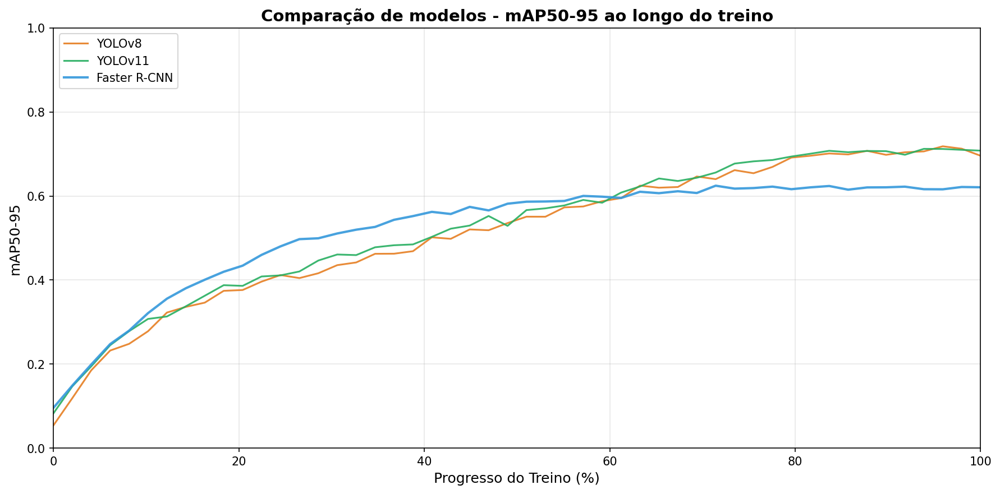

# Detecção Automática de EPIs usando Computer Vision

Sistema de monitoramento automático para identificar o uso correto de Equipamentos de Proteção Individual (EPIs) em ambientes industriais utilizando modelos de detecção de objetos em tempo real.

> **Melhor Modelo**: YOLOv8n com **81.57% mAP@50** e **11.93 ms** de inferência

## Sobre o Projeto

Este projeto implementa e compara três arquiteturas de deep learning para detectar automaticamente a presença e uso correto de EPIs por trabalhadores em canteiros de obras e ambientes industriais. O sistema é capaz de identificar em tempo real se os trabalhadores estão utilizando os equipamentos de segurança obrigatórios, contribuindo para a redução de acidentes e garantindo conformidade com normas de segurança.

### Classes Detectadas

O modelo identifica 7 classes diferentes:

- **Hardhat** (Capacete)
- **Safety Vest** (Colete de segurança)
- **Mask** (Máscara)
- **NO-Hardhat** (Sem capacete)
- **NO-Safety Vest** (Sem colete)
- **NO-Mask** (Sem máscara)
- **Person** (Pessoa)

As classes com prefixo "NO-" indicam a **ausência** do EPI correspondente, permitindo identificar não conformidades.

## Modelos Comparados

### YOLOv8n (Nano)
Detector de estágio único otimizado para detecção em tempo real. Oferece o melhor equilíbrio entre velocidade e precisão para aplicações práticas.

- **Parâmetros**: 9.8M
- **GFLOPs**: 23.6
- **Otimizador**: AdamW

### YOLOv11n (Nano)
Versão mais recente do YOLO com arquitetura aprimorada e otimizada para eficiência. Modelo mais compacto entre os testados.

- **Parâmetros**: 2.6M
- **GFLOPs**: 6.3
- **Otimizador**: AdamW

### Faster R-CNN
Detector de dois estágios com backbone ResNet50-FPN. Mais computacionalmente intensivo, porém com potencial para alta precisão em objetos pequenos.

- **Backbone**: ResNet50-FPN
- **Otimizador**: SGD
- **Classes**: 8 (incluindo background)

## Resultados

### Comparação de Performance

| Modelo | mAP@50 | mAP@50-95 | Tempo de Inferência | Tamanho do Modelo |
|--------|---------|-----------|---------------------|-------------------|
| **YOLOv8n** | **0.8157** | **0.4762** | **11.93 ms** | 5.37 MB |
| YOLOv11n | 0.7154 | 0.4254 | 14.16 ms | **5.22 MB** |
| Faster R-CNN | 0.6239 | 0.2992 | 93.40 ms | 165.55 MB |

### Evolução do Treinamento

O gráfico abaixo mostra a evolução da métrica **mAP@50-95** ao longo de 50 épocas de treinamento para os três modelos:

**Observações importantes:**

- **YOLOv8n** apresentou a melhor performance final com convergência estável
- **YOLOv11n** mostrou performance similar ao YOLOv8n, porém ligeiramente inferior neste dataset específico
- **Faster R-CNN** iniciou com vantagem nos primeiros 40% do treino, mas foi ultrapassado pelos modelos YOLO após 60% de progresso
- Todos os modelos demonstraram convergência adequada, sem sinais de overfitting significativo

### Conclusões

**YOLOv8n** é o modelo recomendado para implementação prática devido a:
- Maior precisão (mAP@50 de 81.57%)
- Velocidade de inferência compatível com tempo real (~12ms por imagem)
- Tamanho compacto para deployment em edge devices

**YOLOv11n** pode ser considerado para ambientes com recursos extremamente limitados, com pequena perda de performance.

**Faster R-CNN** não é recomendado para esta aplicação devido à inferência ~8x mais lenta e menor precisão.

## Dataset

**Fonte**: [Construction Site Safety Image Dataset](https://www.kaggle.com/datasets/snehilsanyal/construction-site-safety-image-dataset-roboflow)

**Características**:
- **Origem**: Kaggle / Roboflow Universe
- **Estrutura**: Divisão train/validation/test
- **Total de imagens de treino**: 2,536
- **Total de imagens de validação**: 84
- **Formato das anotações**: COCO (convertido de YOLO)
- **Tamanho das imagens**: 640x640 pixels

## Tecnologias Utilizadas

- **[Ultralytics YOLO](https://github.com/ultralytics/ultralytics)** - Framework para YOLOv8 e YOLOv11
- **[PyTorch](https://pytorch.org/)** - Framework de deep learning
- **[Torchvision](https://pytorch.org/vision/stable/index.html)** - Implementação do Faster R-CNN
- **[OpenCV](https://opencv.org/)** - Processamento de imagens
- **Python 3.x** - Linguagem de programação

## Referências

1. **Dataset**: [Construction Site Safety Image Dataset - Kaggle](https://www.kaggle.com/datasets/snehilsanyal/construction-site-safety-image-dataset-roboflow)

2. **YOLOv8**: [Ultralytics YOLOv8 Documentation](https://docs.ultralytics.com/models/yolov8/)

3. **YOLOv11**: [Ultralytics YOLOv11 Documentation](https://docs.ultralytics.com/models/yolo11/)

4. **Faster R-CNN**: Ren, S., He, K., Girshick, R., & Sun, J. (2015). "Faster R-CNN: Towards Real-Time Object Detection with Region Proposal Networks". *NeurIPS 2015*.

5. **Roboflow Universe**: [Construction Safety Dataset](https://universe.roboflow.com/)

---

**Notebook completo**: `Tema_2_Grupo_B_(3).ipynb`
